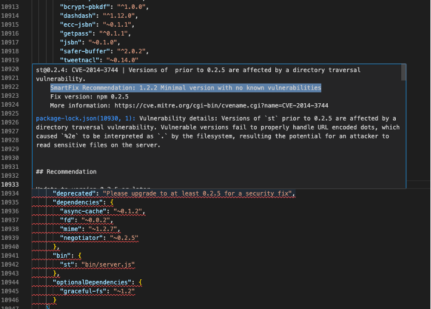
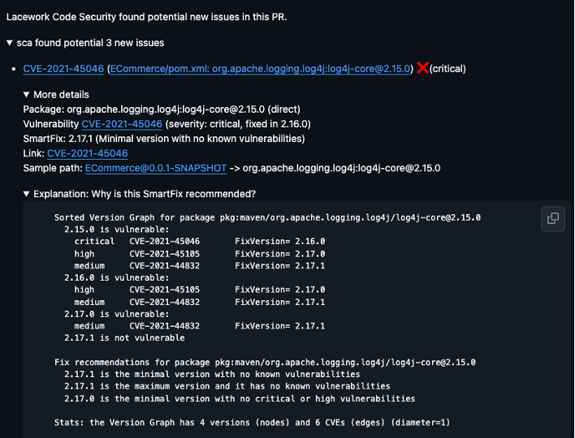

---
buttons:
  - title: Hands on Lab - Download
    icon: material-file-download-outline
    attributes:
      class: md-content__button md-icon
      href: ../hands-on-labs.pdf
      target: _blank
---

# Software Composition Analysis (SCA)

Lacework FortiCNAPP's **Software Composition Analysis (SCA)** scans your project’s dependencies for **known vulnerabilities**, comparing them against trusted vulnerability databases. SCA also links out to third-party CVE descriptions, helping developers and security teams take informed action quickly.

!!! tip "Shift Left with SCA"
    Lacework SCA is designed to be run early in the SDLC—during local development or CI/CD—to reduce risk before vulnerabilities reach production.

---

## Supported Languages & Package Managers

Lacework FortiCNAPP SCA currently supports the following languages and associated file types:

| **Language** | **Package Manager / File Type**               |
|--------------|-----------------------------------------------|
| **C/C++**    | Conan (`conan.lock`)                          |
| **.NET**     | DotNet Core (`*.deps.json`), NuGet (`packages.lock.json`) |
| **Go**       | Go modules (`go.mod`, `go.sum`)               |
| **Java**     | Maven (`pom.xml`), Gradle (`gradle.lockfile`), Bazel |
| **Node.js**  | NPM (`package-lock.json`), Yarn (`yarn.lock`), PNPM (`pnpm-lock.yaml`) |
| **PHP**      | Composer (`composer.lock`)                    |
| **Python**   | Pip (`requirements.txt`), Pipenv (`Pipfile.lock`), Poetry (`poetry.lock`) |
| **Ruby**     | Bundler (`Gemfile.lock`)                      |
| **Rust**     | Cargo (`Cargo.lock`)                          |

!!! note "Partial Lock File Support"
    Some file types may require additional files (e.g., `go.mod` with `go.sum`) for full dependency resolution.

---

### SBOM Management

Lacework FortiCNAPP can generate **Software Bills of Materials (SBOMs)** to provide transparency into your dependency graph—useful for compliance and auditing.

#### Supported SBOM Formats

| **Format**      | **CLI Argument**     |
|-----------------|----------------------|
| SARIF           | `sarif`              |
| CycloneDX       | `cdx-json`, `cdx-xml`|
| SPDX            | `spdx-json`, `spdx-tag`, `spdx-yaml` |
| Lacework (default) | `lw-json`        |
| GitLab          | `gitlab-json`        |

---

### Generating an SBOM

To generate an SBOM for your project:

=== "Command"

```bash
lacework sca scan ./ -f cdx-json -o sbom.json
```

=== "Flags"

- `-f`: Specifies the format of the SBOM (e.g., `cdx-json` for CycloneDX).
- `-o`: Specifies the output file name and path.

!!! example "CycloneDX JSON Output"
    To generate a CycloneDX SBOM in JSON format:
    ```bash
    lacework sca scan ./ -f cdx-json -o sbom.json
    ```

---

### Use Cases

- ✅ Detect open-source vulnerabilities early in development.
- ✅ Block high-severity CVEs in CI/CD pipelines.
- ✅ Export SBOMs for compliance or vendor risk audits.

---

## License Compliance

Lacework FortiCNAPP’s **Software Composition Analysis (SCA)** includes built-in **license detection and compliance validation**. It scans third-party packages in your projects and identifies their associated licenses—classifying them by risk using Google's license classifier.

!!! important "Why It Matters"
    License compliance is critical for organizations that need to meet internal software policies, open-source usage rules, or external audit requirements.

---

### License Categories

Lacework classifies licenses into categories based on usage rights and restrictions. These categories are derived from Google’s [license classifier](https://opensource.google/documentation/reference/using-the-license-checker).

#### Forbidden

Licenses that **cannot be used** due to legal or policy restrictions.

!!! danger
    Includes:
    `AGPL-3.0`

#### Restricted

Licenses that **require source distribution** or impose redistribution constraints.

!!! warning
    Includes:
    `GPL-2.0`, `GPL-3.0`, `LGPL-2.1`, `Sleepycat`, `CC-BY-NC-*`, `Facebook-*`

#### Reciprocal

Can be used freely **in unmodified form**, but may require derivative works to be open-sourced.

!!! example
    Includes:
    `EPL-1.0`, `CDDL-1.0`, `APSL-*`, `MPL-*`, `IPL-1.0`

#### Notice

Permissive licenses that allow redistribution and modification with attribution.

!!! note
    Includes:
    `MIT`, `BSD-3-Clause`, `Apache-2.0`, `Zlib`, `Python-2.0`, `PHP-3.01`

#### Unencumbered

Free to use **without significant restriction**.

!!! success
    Includes:
    `Unlicense`, `CC0-1.0`, `ZeroBSD`

#### Other

- **permissive (uncommon)** – Minimal conditions, rare usage
- **unknown** – Undetermined license
- **custom** – Manually defined or non-standard license

---

### Configuring License Compliance Policies

Lacework SCA uses a YAML config file to enforce license restrictions.

#### File Path

```txt
~/.config/lacework/components/sca/.lacework/codesec.yml
```

#### Example Config

```yaml
environments:
  - name: default
    licenses-not-allowed: []
    license-categories-not-allowed: []

  - name: demo
    licenses-not-allowed: []
    license-categories-not-allowed: [forbidden, restricted]
```

!!! tip "Customizing License Policies"
    - Use `licenses-not-allowed` to block specific license names (e.g. `"GPL-3.0"`)
    - Use `license-categories-not-allowed` to block entire groups like `"forbidden"` or `"restricted"`

---

### Scanning with License Enforcement

To scan a project using a specific license policy environment:

```bash
lacework sca dir . -o sca.json --pull-deps --env demo
```

#### Flags

- `--env demo`: Uses the `demo` environment policy
- `--pull-deps`: Ensures all dependencies are resolved
- `-o sca.json`: Saves the output SBOM

---

### License Scanning Output

SCA license scanning results include:

- 📜 **License name** per package
- 🔒 **Category** (e.g. forbidden, reciprocal)
- ✅ **Confidence score** on accuracy

!!! example "Sample Finding"
    ```
    Package: lodash
    License: MIT
    Category: notice
    ```

---

### Best Practices

- 🔍 Audit dependencies regularly for restricted or unknown licenses
- ⚙️ Integrate license policy config with version control
- 🧪 Use CI/CD scans to block merges with non-compliant licenses

---

## SmartFix

**SmartFix** is Lacework FortiCNAPP's intelligent recommendation engine for resolving vulnerabilities detected during Software Composition Analysis (SCA). It delivers **actionable**, **conflict-free**, and **optimized** fixes directly within your development tools and workflows.

---

### Where SmartFix is Available

SmartFix is automatically enabled and integrated into the following environments:

- ✅ **Lacework FortiCNAPP UI** (via the SCA findings panel)
- ✅ **SCM integrations** (e.g., GitHub PR comments)
- ✅ **Lacework CLI scans**
- ✅ **Supported IDEs** (e.g., VS Code)

!!! tip
    SmartFix runs automatically during SCA scans and does not require separate activation or configuration.

---

### Key Features

| Feature                    | Description                                                                 |
|----------------------------|-----------------------------------------------------------------------------|
| **Unified Fix Suggestions**| Recommends a single package version to resolve **multiple CVEs at once**.   |
| **Conflict Resolution**    | Avoids conflicting upgrades from multiple vulnerabilities.                  |
| **Context-Aware Upgrades** | Considers CVE severity and package stability in recommendations.            |

---

### How SmartFix Works

SmartFix analyzes vulnerable packages and evaluates future versions to determine the best upgrade path using a prioritized strategy:

#### Recommendation Algorithms

1. **Minimal Version with No Vulnerabilities**  
   - Smallest upgrade that fixes **all** known vulnerabilities.

2. **Minimal Version with No Critical Vulnerabilities**  
   - Fixes critical CVEs while minimizing version drift.

3. **Maximal Version with No Vulnerabilities**  
   - Latest version that resolves all issues.

4. **No SmartFix Recommendation**  
   - Returned when no safe upgrade path exists.

!!! info "Prioritization Order"
    SmartFix evaluates upgrade options in this order:

    1. Minimal version with no vulnerabilities  
    2. Minimal version with no *critical* vulnerabilities  
    3. Maximal version with no vulnerabilities  
    4. No SmartFix recommendation (explicitly stated if no fix meets criteria)

---

### Real-World Example

!!! example "Log4J Case"
    In early Log4J incidents, initial fixes introduced new CVEs.  
    SmartFix would recommend a version that **resolved the initial CVE** *and* **avoided introducing new ones**, improving fix quality and reducing rework.

---

### Benefits of SmartFix

| Benefit               | Description                                                                 |
|-----------------------|-----------------------------------------------------------------------------|
| **Saves Time**        | Resolves multiple issues with one upgrade.                                  |
| **Reduces Risk**      | Avoids introducing new vulnerabilities.                                     |
| **Simplifies Choices**| Prevents conflicting or redundant recommendations.                          |

---

### Using SmartFix

No special configuration is required. SmartFix is:

- 🔁 **Enabled by default**
- ⚙️ **Executed with every SCA scan**
- 🖥️ **Displayed in:**
  - **UI**: Shown in the *Fix Version* column beside NVD fixes
  - **CLI**: Included in scan output files
  - **IDE**: Highlighted in code as suggestions
  - **SCM PRs**: Auto-commented on pull requests with inline fix advice

SmartFix is available in multiple developer-facing environments to provide remediation guidance where it's needed most:

??? note "💻 IDE Extensions"
    SmartFix recommendations can be accessed directly within supported Integrated Development Environments (IDEs), enabling developers to address vulnerabilities as they code.

    

??? note "🔄 Pull Request Comments"
    As part of Lacework's SCM integration, SmartFix automatically generates comments on pull requests, providing actionable recommendations for resolving vulnerabilities before code is merged.

    

---

### Example CLI Usage

```bash
lacework sca scan ./ --output sca.json
```

📎 SmartFix data will be included in the output and shown in the UI if results are uploaded.

## Hands-On

This guided section helps you generate a vulnerable project, scan it, and see SmartFix in action using GitHub and VS Code.

---

### Step 1: Clone the Lab Project

```bash
git clone https://github.com/40docs/lab_forticnapp_code_security.git
cd lab_forticnapp_code_security
```

---

### Step 2: Open in VS Code

1. Open the folder in **Visual Studio Code**
2. Install the **Lacework Security** extension from the Marketplace
3. Click the **Lacework shield icon** in the sidebar
4. Sign in using **“Sign in with Lacework”** (OAuth)
5. Run a scan using one of the options:

   - **Start All Scans**
   - **Start SCA Scan**

!!! tip
    The extension highlights issues inline, including SmartFix recommendations where available.

---

### Step 3: Trigger a SmartFix via GitHub PR

To see SmartFix in GitHub:

!!! note "Trigger a Scan"
    A Pull Request to the repo triggers a SCA scan automatically, within minutes a comment will be added to the PR.

    ```bash
    echo "paramiko==2.4.1" >> app/requirements.txt && \
    git checkout -b trigger-smartfix && \
    git add app/requirements.txt && \
    git commit -m "Add vulnerable dep to trigger SmartFix" && \
    git push -u origin trigger-smartfix && \
    gh pr create --fill
    ```
---

!!! note "GitHub CLI Required"
    Ensure [GitHub CLI](https://cli.github.com/) is installed and authenticated to use `gh pr create`.

This opens a pull request that triggers FortiCNAPP scanning and displays SmartFix suggestions as inline PR comments or in the Lacework UI.

---

### Step 4: View and Apply Fixes

1. Open the PR on GitHub
2. Review SCA findings and SmartFix suggestions
3. Optionally apply fixes manually or inline in the IDE

---

### Related CLI Example

Run a scan and generate SmartFix recommendations via CLI:

```bash
lacework sca scan ./app --output sca-results.json
```

!!! info "SBOM + SmartFix"
    If you include `--formats cdx-json` or similar, the scan will also produce a Software Bill of Materials (SBOM) alongside vulnerability results.
